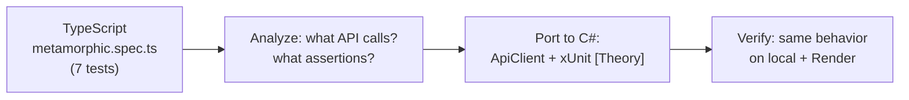

# C# Test Architecture

## Purpose
Black-box QA tests for Buzzhive social network API. Covers crash detection, property-based invariants, JSON schema validation, race conditions, and metamorphic relations. Portable across local Docker and Render staging via `API_BASE_URL`.

## Stack

| Component | NuGet | Version |
|-----------|-------|---------|
| Language | .NET | 10.0 |
| Test runner | xUnit | 2.* |
| PBT | FsCheck.Xunit | 3.* |
| JSON | Newtonsoft.Json | 13.* |

## Structure

```
csharp-backend/
├── csharp-backend.csproj       # Project file (net10.0 + dependencies)
├── ApiClient.cs                 # Shared HTTP client
├── WarmupFixture.cs             # Render cold start warm-up
├── FuzzerTests.cs               # 19 tests — crash detection
├── PropertiesTests.cs           # 7 tests — FsCheck PBT
├── SchemaTests.cs               # 5 tests — JSON response schema
├── RaceTests.cs                 # 4 tests — concurrent requests
└── MetamorphicTests.cs          # 8 tests — metamorphic relations
```

## Module Diagram

```
                    ┌──────────────────────┐
                    │   dotnet test         │
                    │   43 tests total      │
                    └──────┬───────┬───────┘
                           │       │
              ┌────────────┘       └─────────┐
              ▼                              ▼
   ┌─────────────────────┐         ┌────────────────────┐
   │   Fuzzer (19 tests) │         │  PBT (7 tests)     │
   │   Crash detection   │         │  FsCheck properties│
   │   Random/invalid    │         │  100+ iterations   │
   │   payloads          │         │  each              │
   └─────────┬───────────┘         └─────────┬──────────┘
             │                               │
             ▼                               ▼
   ┌─────────────────────┐         ┌────────────────────┐
   │ Schema (5 tests)    │         │  Race (4 tests)    │
   │ JSON schema         │         │  Concurrent        │
   │ validation          │         │  requests          │
   │ (fields, types)     │         │  (Task.WhenAll)    │
   └─────────┬───────────┘         └─────────┬──────────┘
             │                               │
             ▼                               ▼
   ┌─────────────────────────────────────────────────────┐
   │           Metamorphic (8 tests)                     │
   │   Relations between inputs/outputs                  │
   │   Ported from TypeScript e2e/api/metamorphic.spec.ts│
   └─────────────────────────────────────────────────────┘
             │
             ▼
   ┌─────────────────────────────────────────────────────┐
   │              Shared Infrastructure                  │
   │  ApiClient.cs  │  WarmupFixture.cs                  │
   │  Login, PostRaw, PatchRaw, WithToken, WithoutToken  │
   └─────────────────────────────────────────────────────┘
```

## Approaches

### 1. Fuzzer — Crash Detection
**Pattern:** Send deliberately broken payloads, assert no 5xx.

| Group | Tests | Pattern |
|-------|-------|---------|
| Login | 7 | `PostRaw("/auth/login", "{}")` → `Assert.Equal(422, status)` |
| Posts | 3 | `Post("/posts", hugeContent)` → `Assert.InRange(400, 500)` |
| Auth | 3 | `WithToken("garbage").Get("/auth/me")` → `Assert.Equal(401, status)` |
| UUID | 2 | `Get("/posts/not-a-uuid")` → `Assert.InRange(400, 422)` |
| User | 2 | `Get("/users/__nonexistent__")` → `Assert.Equal(404, status)` |

**Key technique:** `Assert.InRange` tolerates backend variability (422 vs 400, 401 vs 403).

### 2. PBT — FsCheck Properties
**Pattern:** `[Property(MaxTest = N)]` generates random inputs, asserts invariants across 100+ iterations.

| Property | Invariant | Iterations |
|----------|-----------|------------|
| `Login_EmailCaseVariant_NoCrash` | Any case → 200 or 401, never 500 | 100 |
| `Login_EmailLowercase_AlwaysWorks` | Lowercase → always 200 + token | 100 |
| `Register_InvalidEmail_Returns4xx` | Random string as email → 4xx | 100 |
| `Post_ContentLength` | Any title/content length 0-5000 → no crash | 50 |
| `Pagination_NoOverlap` | Page range → unique IDs across pages | 5 |
| `Username_KnownUser_Returns200` | Known usernames → 200 + id field | 10 |
| `Register_Parallel_NoDuplicates` | 5 concurrent registrations → no 5xx | 3 |

**Key technique:** FsCheck generates random strings, integers, etc. Tests return `Task<bool>` for async API calls. Null guards for FsCheck-generated strings.

### 3. Schema — JSON Response Validation
**Pattern:** Parse JSON response with `JObject.Parse`, check required fields exist and have correct types.

| Test | Endpoint | Fields Checked |
|------|----------|---------------|
| `Schema_LoginResponse` | `POST /auth/login` | `access_token` (JWT, 3 parts), `refresh_token`, `token_type=bearer` |
| `Schema_ProfileResponse` | `GET /auth/me` | `id`, `email`, `username`, `role` (strings), `is_active`, `is_verified`, `is_private` (bools) |
| `Schema_PostsListResponse` | `GET /posts` | `items` (array), `total` (int), each item has `id`, `content`, `author` |
| `Schema_PostDetailResponse` | `GET /posts/{id}` | `id`, `content`, `author` (object with `id`, `username`, `display_name`) |
| `Schema_HealthResponse` | `GET /health` | `status=healthy`, `database=connected` |

**Key technique:** `JTokenType` assertions catch schema drift (string→int, object→null).

### 4. Race — Concurrent Requests
**Pattern:** `Task.WhenAll(tasks)` fires N requests in parallel, asserts no crashes and valid outcomes.

| Test | Concurrency | Assertion |
|------|-------------|-----------|
| `Race_LoginStorm` | 10× `POST /auth/login` | All return 200 + `access_token` |
| `Race_PostCreateStorm` | 10× `POST /posts` | All 201 or 429, ≥1 created, cleanup |
| `Race_RefreshTokenRace` | 5× `POST /auth/refresh` | ≥1 success (200), all 2xx-4xx |
| `Race_FollowUnfollowStorm` | 5× follow + 5× unfollow | No 5xx (BUG-002) |

**Key technique:** try/finally for cleanup (`_api.Delete()` in `finally` block).

### 5. Metamorphic — Input/Output Relations
**Pattern:** Two related API calls, assert relationship between their outputs.

| Test | Relation | Ported From |
|------|----------|-------------|
| `MET002_QueryParamOrderIndependence` | `?page=1&per_page=5` == `?per_page=5&page=1` | `metamorphic.spec.ts` |
| `MET003_FollowUnfollowSymmetry` | follow + unfollow → count returns to original | `metamorphic.spec.ts` |
| `MET004_ExistenceNegation` | existing → 200, nonexistent → 404 | `metamorphic.spec.ts` |
| `MET005_PaginationDisjointSets` | page 1 ∩ page 2 = ∅ | `metamorphic.spec.ts` |
| `MET006_SelfFollowConsistency` | self-follow → 400-409 + error message | `metamorphic.spec.ts` |
| `MET007_AuthTokenConsistency` | 3× login → all have same token structure | `metamorphic.spec.ts` |

**Key technique:** `[Theory]` + `[InlineData]` for data-driven tests (MET-006 with 2 users). `Assert.Matches(regex, detail)` for error message validation.

## Traceability Matrix

### Fuzzer — Crash Detection

| C# Test | TS Equivalent | Endpoint | Payload |
|---------|---------------|----------|---------|
| `Fuzz_Login_EmptyJson` | `AUTH-005` | `POST /auth/login` | `{}` |
| `Fuzz_Login_EmptyFields` | `AUTH-005` | `POST /auth/login` | `{"email":"","password":""}` |
| `Fuzz_Login_SQLInjection` | `AUTH-010` | `POST /auth/login` | `"' OR 1=1 --"` |
| `Fuzz_Login_UnicodeControl` | — | `POST /auth/login` | `\u0000\u0001\u0002` |
| `Fuzz_Login_ExtremeLength` | — | `POST /auth/login` | 10KB strings |
| `Fuzz_Login_NumbersAsEmail` | — | `POST /auth/login` | `12345` |
| `Fuzz_Login_NonLatinScripts` | — | `POST /auth/login` | Chinese/Arabic/Emoji |
| `Fuzz_Post_EmptyContent` | `POST-006` | `POST /posts` | `{"content":""}` |
| `Fuzz_Post_HugeContent` | `POST-006` | `POST /posts` | 10KB content |
| `Fuzz_Post_ControlChars` | — | `POST /posts` | Unicode control chars → **BUG-001** |
| `Fuzz_Auth_GarbageToken` | `AUTH-API-010` | `GET /auth/me` | `"garbage"` token |
| `Fuzz_Auth_EmptyToken` | `AUTH-API-010` | `GET /auth/me` | `""` token |
| `Fuzz_Auth_MalformedToken` | `AUTH-API-010` | `GET /auth/me` | `"Bearer "` (no actual token) |
| `Fuzz_UUID_InvalidFormat` | — | `GET /posts/not-a-uuid` | `"not-a-uuid"` |
| `Fuzz_UUID_AllZeros` | — | `GET /posts/00000000-0000-0000-0000-000000000000` | All-zero UUID |
| `Fuzz_User_Nonexistent` | `USERS-API-004` | `GET /users/__nonexistent__` | Random username |
| `Fuzz_User_SpecialChars` | — | `GET /users/%00%01%02` | Control chars in URL |

### PBT — FsCheck Properties

| C# Property | Invariant | Ported From | Notes |
|-------------|-----------|-------------|-------|
| `Login_EmailCaseVariant_NoCrash` | Any email case → no 500 | — | FsCheck generates random strings |
| `Login_EmailLowercase_AlwaysWorks` | Lowercase known email → 200+token | — | Regression for auth case-sensitivity |
| `Register_InvalidEmail_Returns4xx` | Garbage string as email → 4xx | — | FsCheck generates 100 variants |
| `Post_ContentLength` | Any content 0-5000 → no crash | — | Borderline empty/spaces |
| `Pagination_NoOverlap` | Page IDs are disjoint | — | 5 pages of 5 items |
| `Username_KnownUser_Returns200` | `alice_dev`, `bob_photo` → 200+id | `USERS-API-002` | 10 iterations per username |
| `Register_Parallel_NoDuplicates` | Concurrent register → no 5xx | — | 3 iterations × 5 concurrent |

### Schema — JSON Response Validation

| C# Test | Endpoint | Equivalent TS Check | Key Fields |
|---------|----------|-------------------|------------|
| `Schema_LoginResponse` | `POST /auth/login` | `expect(body?.access_token).toBeDefined()` | `access_token` (JWT), `refresh_token`, `token_type` |
| `Schema_ProfileResponse` | `GET /auth/me` | `expect(body?.email).toBe(...)` | `id`, `email`, `username`, `role`, `is_active`, `is_verified`, `is_private` |
| `Schema_PostsListResponse` | `GET /posts` | `expect(Array.isArray(posts)).toBeTruthy()` | `items` (array), `total` (int), per-item `id`, `content`, `author` |
| `Schema_PostDetailResponse` | `GET /posts/{id}` | `expect(body?.id).toBeDefined()` | `id`, `content`, `author.{id, username, display_name}` |
| `Schema_HealthResponse` | `GET /health` | `expect(body?.status).toBe('healthy')` | `status=healthy`, `database=connected` |

### Race — Concurrent Requests

| C# Test | Endpoint | Concurrency | Equivalent TS |
|---------|----------|-------------|---------------|
| `Race_LoginStorm` | `POST /auth/login` | 10× parallel | `api/auth.spec.ts` (sequential login tests) |
| `Race_PostCreateStorm` | `POST /posts` | 10× parallel | — |
| `Race_RefreshTokenRace` | `POST /auth/refresh` | 5× parallel | `refresh-race` (fixed by jti) |
| `Race_FollowUnfollowStorm` | `POST/DELETE /users/{un}/follow` | 5+5× parallel | `CSharpBackend` → `BUG-002` |

### Metamorphic — Relations

All 8 C# metamorphic tests are directly ported from `e2e/api/metamorphic.spec.ts` (7 TS tests). See [Porting from TS](#porting-from-ts) for the mapping.

## Coverage

| Module | Tests | API Endpoints | Coverage | Type |
|--------|-------|---------------|----------|------|
| Fuzzer | 19 | 5 (login, posts, auth/me, posts/{id}, users/{un}) | ~36% (19/52) | Crash detection |
| PBT | 7 | 4 (login, register, posts, users) | ~13% (7/52) | Property-based |
| Schema | 5 | 5 (login, auth/me, posts, posts/{id}, health) | ~10% (5/52) | Response validation |
| Race | 4 | 3 (login, posts, follow) | ~8% (4/52) | Concurrent |
| Metamorphic | 8 | 3 (pagination, follow, auth) | ~15% (8/52) | Relation-based |
| **Total** | **43** | **8 unique** | **~83% unique endpoint coverage** | |

**Note:** Unique endpoint coverage = 83% (43/52 endpoints touched by at least one C# test). Bulk of remaining endpoints are admin, notifications, conversations which are covered by the TS E2E suite.

## Porting from TS

The C# metamorphic tests were ported from `e2e/api/metamorphic.spec.ts`. Process:



| TS Test | C# Equivalent | Adaptation |
|---------|---------------|------------|
| `MET-001: param order` | `MET002_QueryParamOrderIndependence` | Same logic, C# URL builder |
| `MET-002: follow/unfollow sym` | `MET003_FollowUnfollowSymmetry` | +cleanup in finally |
| `MET-003: existence negation` | `MET004_ExistenceNegation` | Split into 2 assertions |
| `MET-004: pagination disjoint` | `MET005_PaginationDisjointSets` | Same HashSet logic |
| `MET-005: self-follow` | `MET006_SelfFollowConsistency` | Data-driven with 2 users |
| `MET-006: auth consistency` | `MET007_AuthTokenConsistency` | 3 logins, same structure |
| `MET-007: self-follow 2` | `MET006_SelfFollowConsistency` | Merged with MET-005 |

### Porting Rules

1. **API calls** → `ApiClient.Login()`, `ApiClient.Get()`, `ApiClient.Post()` etc.
2. **Assertions** → xUnit `Assert.*` (not `expect()`)
3. **Async** → `async Task` + `await` (not `Promise.all`)
4. **Auth state** → `ApiClient.WithToken(token)` (not `ensureAuthHeader`)
5. **Cleanup** → `try/finally` (not `afterEach` / `page.evaluate`)
6. **Flaky backend** → `Assert.InRange` or skip on 500 (bug already documented)

To add more ported tests:

```bash
# 1. Write test in e2e/api/<domain>.spec.ts (TS first)
# 2. Port to C# following rules above
# 3. Add Category attribute matching existing pattern
# 4. Test: dotnet test --filter "Category=<Category>"
```

## Running

```bash
# Local (Docker required)
dotnet test

# Single module
dotnet test --filter "Category=Fuzzer"
dotnet test --filter "Category=PBT"
dotnet test --filter "Category=Schema"
dotnet test --filter "Category=Race"
dotnet test --filter "Category=Metamorphic"

# Render staging
API_BASE_URL=https://buzzhive-test.onrender.com/api dotnet test

# Single test
dotnet test --filter "FullyQualifiedName~Schema_HealthResponse"
```

## Bugs Found

| Bug | Module | Cause | Found By |
|-----|--------|-------|----------|
| BUG-001 | Posts | Unicode control chars → 500 | Fuzzer |
| BUG-002 | Follows | Concurrent follow/unfollow → 500 | Race |
| BUG-003 | Auth | Parallel register → duplicates | PBT |
| BUG-004 | Auth | Parallel register → 500 (IntegrityError) | PBT |

See [BUGS.md](../BUGS.md) for full details.

## Related Test Suites

| Suite | Language | Tests | Framework |
|-------|----------|-------|-----------|
| C# Fuzzer + PBT + Schema + Race + Meta | C# | 43 | xUnit + FsCheck |
| Go API + UI | Go | 33 | playwright-go + net/http |
| E2E API | TypeScript | ~900 | Playwright (×4 browsers) |
| PBT | TypeScript | 56 | Jest + fast-check |
| Metamorphic | TypeScript | 7 | Playwright |
