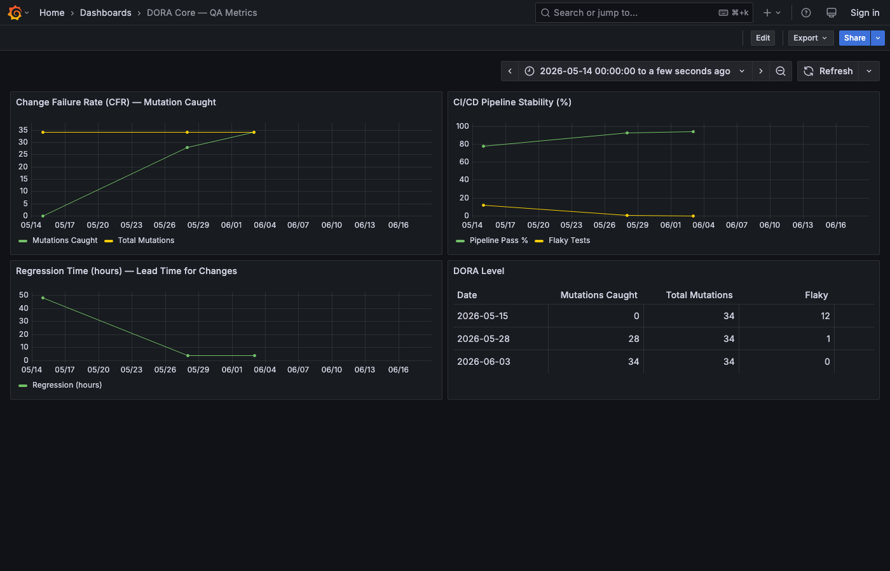

<link rel="stylesheet" href="style.css">

# DORA Monthly Reports

Centralised DORA metrics dashboard for QA Automation Sandbox projects.

---

## Quick Dashboard

  

    <h3>Buzzhive CFR</h3>
    
6%

    
↓ from 7.5%

  

  

    <h3>Lead Time</h3>
    
4h

    
Stable

  

  

    <h3>MTTR</h3>
    
4h

    
Stable

  

  

    <h3>Mutation CFR</h3>
    
100%

    
↑ from 82%

  

  

    <h3>Flaky Tests</h3>
    
0

    
↓ from 1

  

  

    <h3>OrangeHRM Coverage</h3>
    
73%

    
↑ from 20%

  

---

## Buzzhive (qa-automation-sandbox)

| Month | CFR | Lead Time | MTTR | Mutation CFR | Flaky | Trend |
|-------|-----|-----------|------|--------------|-------|-------|
| [May 2026](buzzhive/2026-05.md) | 7.5% | 4h | 4h | 28/34 | 1 | — |
| [June 2026](buzzhive/2026-06.md) | 6% | 4h | 4h | 34/34 | 0 | ↓ |

### DORA Levels (June 2026)

| Metric | Value | Level |
|--------|-------|-------|
| CFR | 6% | High |
| Lead Time | 4h | High |
| MTTR | 4h | High |

[Methodology →](methodology.md)

---

## OrangeHRM

| Month | Coverage | Modules | POMs | Smoke Tests |
|-------|----------|---------|------|-------------|
| [May 2026](orangehrm/2026-05.md) | 20% | 4 | 0 | 0 |
| [June 2026](orangehrm/2026-06.md) | 73% | 14 | 14 | 25 |

> **Note:** OrangeHRM does not yet have DORA core metrics (CI/CD, Allure).
> Only test coverage data is available at this stage.

---

## Grafana Dashboard

*Snapshot: 2026-06-18 — 4 panels: CFR, Pipeline Stability, Regression Time, DORA Level*

[Open in Grafana →](http://localhost:3003/d/dora-core/dora-core-e28094-qa-metrics)